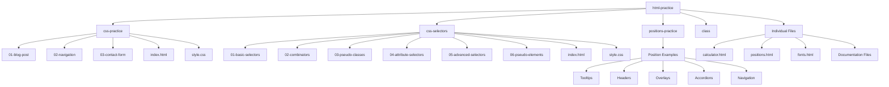

# Project Structure

## Files and Directories

- 📄 COMPONENT_STRUCTURE.md
- 📄 MOCKUP.md
- 📄 README.md
- 📄 TODO_APP_PRD.md
- 📄 attribute-selector.html
- 📄 calculator.html
- 📁 class/
- 📄 combinatores.html
- 📁 css-practice/
  - 📁 01-blog-post/
    - 📄 index.html
    - 📄 style.css
  - 📁 02-navigation/
    - 📄 index.html
    - 📄 style.css
  - 📁 03-contact-form/
    - 📄 index.html
    - 📄 style.css
  - 📄 index.html
  - 📄 style.css
- 📁 css-selectors/
  - 📁 01-basic-selectors/
    - 📄 index.html
    - 📄 style.css
  - 📁 02-combinators/
    - 📄 index.html
    - 📄 style.css
  - 📁 03-pseudo-classes/
    - 📄 index.html
    - 📄 style.css
  - 📁 04-attribute-selectors/
    - 📄 index.html
    - 📄 style.css
  - 📁 05-advanced-selectors/
    - 📄 index.html
    - 📄 style.css
  - 📁 06-pseudo-elements/
    - 📄 index.html
    - 📄 style.css
  - 📄 index.html
  - 📄 style.css
- 📄 fonts.html
- 📄 positions.css
- 📄 positions.html
- 📁 postions-practice/
  - 📄 Absolute Positioned Tooltip.html
  - 📄 Fixed-Header.html
  - 📄 Image with Badge.html
  - 📄 Simple Overlay.html
  - 📄 Sticky Section Title.html
  - 📄 accordion-2.html
  - 📄 accordion.html
  - 📄 css-modal.html
  - 📄 css-tooltip.html
  - 📄 faq-toggle.html
  - 📄 image-gallery.html
  - 📄 key-concept.txt
  - 📄 nav-menu-links.html
  - 📄 nav-menu.html
  - 📄 tab-switcher.html
- 📄 pseudo-classes.html
- 📄 pseudo-elements.html
- 📄 todo-flow.png
- 📄 todos.json

## Project Structure Diagram

