# CSS Selectors Learning Hub 🎯

A comprehensive, interactive learning platform for mastering CSS selectors from beginner to advanced level. This repository contains structured modules with hands-on examples, visual demonstrations, and practical exercises.

## 📚 Overview

This learning hub provides a step-by-step approach to understanding CSS selectors through 6 progressive modules, each with interactive HTML/CSS examples and detailed explanations.

## 🗂️ Project Structure

```mermaid
graph TD
    A[🏠 Root Directory] --> B[index.html - Main Hub]
    A --> C[style.css - Main Styles]
    A --> D[📁 css-selectors/]
    A --> E[📄 README.md]
    
    D --> F[📁 01-basic-selectors/]
    D --> G[📁 02-combinators/]
    D --> H[📁 02-pseudo-classes/]
    D --> I[📁 03-pseudo-elements/]
    D --> J[📁 04-attribute-selectors/]
    D --> K[📁 05-advanced-selectors/]
    D --> L[index.html - Navigation]
    
    F --> F1[index.html]
    F --> F2[style.css]
    
    G --> G1[index.html]
    G --> G2[style.css]
    
    H --> H1[index.html]
    H --> H2[style.css]
    
    I --> I1[index.html]
    I --> I2[style.css]
    
    J --> J1[index.html]
    J --> J2[style.css]
    
    K --> K1[index.html]
    K --> K2[style.css]
    
    style A fill:#667eea,color:#fff
    style D fill:#764ba2,color:#fff
    style F fill:#48bb78,color:#fff
    style G fill:#48bb78,color:#fff
    style H fill:#48bb78,color:#fff
    style I fill:#ed8936,color:#fff
    style J fill:#ed8936,color:#fff
    style K fill:#e53e3e,color:#fff
```



## 🎓 Learning Path

```mermaid
flowchart LR
    A[🎯 Start Here] --> B[01 Basic Selectors]
    B --> C[02 Combinators]
    C --> D[03 Pseudo-classes]
    D --> E[04 Pseudo-elements]
    E --> F[05 Attribute Selectors]
    F --> G[06 Advanced Selectors]
    G --> H[🏆 CSS Selector Master!]
    
    subgraph "Beginner Level"
        B
        C
        D
    end
    
    subgraph "Intermediate Level"
        E
        F
    end
    
    subgraph "Advanced Level"
        G
    end
    
    style A fill:#667eea,color:#fff
    style H fill:#28a745,color:#fff
    style B fill:#48bb78,color:#fff
    style C fill:#48bb78,color:#fff
    style D fill:#48bb78,color:#fff
    style E fill:#ed8936,color:#fff
    style F fill:#ed8936,color:#fff
    style G fill:#e53e3e,color:#fff
```



## 🔍 CSS Selector Types Hierarchy

```mermaid
mindmap
    root((CSS Selectors))
        Basic Selectors
            Element
                p, div, h1
            Class
                .class-name
            ID
                #unique-id
            Universal
                *
            Attribute
                [attr]
                [attr="value"]
        Combinators
            Descendant
                div p
            Child
                div > p
            Adjacent Sibling
                h1 + p
            General Sibling
                h1 ~ p
        Pseudo-classes
            Interactive
                :hover
                :focus
                :active
            Structural
                :first-child
                :last-child
                :nth-child()
            Form States
                :required
                :checked
                :disabled
            Logical
                :not()
                :is()
                :where()
        Pseudo-elements
            Content
                ::before
                ::after
            Text
                ::first-line
                ::first-letter
            User Interface
                ::placeholder
                ::selection
        Advanced
            Complex Combinations
                .class1.class2
                div > .class + p
            Specificity Rules
                Inline > IDs > Classes > Elements
            Real-world Patterns
                Navigation
                Forms
                Layouts
```

## 📊 CSS Specificity Calculator


## 📋 Module Contents

### 🟢 Beginner Level

#### 01. Basic Selectors
- **Element Selectors**: `p`, `div`, `h1`
- **Class Selectors**: `.className`
- **ID Selectors**: `#uniqueID`
- **Universal Selector**: `*`
- **Basic Attribute Selectors**: `[attribute]`

#### 02. Combinators
- **Descendant Combinator**: `ancestor descendant`
- **Child Combinator**: `parent > child`
- **Adjacent Sibling**: `element + next-sibling`
- **General Sibling**: `element ~ siblings`

#### 03. Pseudo-classes
- **Interactive States**: `:hover`, `:focus`, `:active`
- **Structural**: `:first-child`, `:last-child`, `:nth-child()`
- **Form States**: `:required`, `:optional`, `:checked`
- **Logical**: `:not()`, `:is()`

### 🟡 Intermediate Level

#### 04. Pseudo-elements
- **Content Generation**: `::before`, `::after`
- **Text Styling**: `::first-line`, `::first-letter`
- **UI Elements**: `::placeholder`, `::selection`
- **Practical Examples**: Tooltips, counters, decorative elements

#### 05. Attribute Selectors
- **Exact Match**: `[attr="value"]`
- **Contains Word**: `[attr~="value"]`
- **Starts With**: `[attr^="value"]`
- **Ends With**: `[attr$="value"]`
- **Contains Substring**: `[attr*="value"]`
- **Language Matching**: `[attr|="value"]`
- **Case Insensitive**: `[attr="value" i]`

### 🔴 Advanced Level

#### 06. Advanced Selectors
- **Complex Combinations**: Multiple selectors and relationships
- **Specificity Rules**: Understanding CSS cascade
- **Performance Considerations**: Efficient selector patterns
- **Real-world Examples**: Navigation, forms, layouts
- **Best Practices**: Maintainable and scalable CSS

## 🚀 Getting Started


### Quick Start Guide

1. **Clone or Download** this repository
2. **Open `index.html`** in your web browser
3. **Follow the learning path** from Basic Selectors to Advanced
4. **Practice with examples** in each module
5. **Use browser dev tools** to experiment further

## 🎨 Features

### ✨ Interactive Learning
- **Visual Examples**: See selectors in action
- **Color-coded Demonstrations**: Easy to understand targeting
- **Hover Effects**: Interactive feedback
- **Real-time Results**: Immediate visual feedback

### 📱 Modern Design
- **Responsive Layout**: Works on all devices
- **Beautiful UI**: Modern gradient designs
- **Smooth Animations**: Engaging user experience
- **Accessibility**: Keyboard navigation and screen reader friendly

### 🧪 Practical Examples
- **Navigation Menus**: Real dropdown implementations
- **Form Styling**: Validation states and interactions
- **Layout Patterns**: Cards, grids, and complex layouts
- **Typography**: Advanced text styling techniques

## 🎯 Learning Objectives


## 🔧 Technical Details

### Browser Support
- **Modern Browsers**: Chrome, Firefox, Safari, Edge
- **CSS3 Features**: Full support for modern selectors
- **Fallbacks**: Graceful degradation for older browsers

### Performance
- **Optimized CSS**: Efficient selector patterns
- **Minimal Dependencies**: No external frameworks
- **Fast Loading**: Optimized assets and structure

## 📖 How to Use Each Module


## 🤝 Contributing

Feel free to contribute to this learning resource:

1. **Report Issues**: Found a bug or unclear explanation?
2. **Suggest Improvements**: Ideas for better examples?
3. **Add Examples**: More real-world use cases?
4. **Fix Typos**: Help improve documentation

## 📜 License

This educational resource is open source and available for learning purposes.

## 🎊 Completion Certificate

```mermaid
graph LR
    A[Complete All 6 Modules] --> B[Master CSS Selectors]
    B --> C[Build Complex Layouts]
    C --> D[Optimize Performance]
    D --> E[🏆 CSS Selector Expert]
    
    style A fill:#667eea,color:#fff
    style E fill:#ffd700,color:#000
```



Once you complete all modules, you'll have mastered:
- ✅ All CSS selector types and syntax
- ✅ Complex selector combinations
- ✅ Performance best practices
- ✅ Real-world application patterns
- ✅ Debugging and optimization techniques

---

**Happy Learning! 🚀** Start your CSS selector mastery journey by opening `index.html` in your browser. 