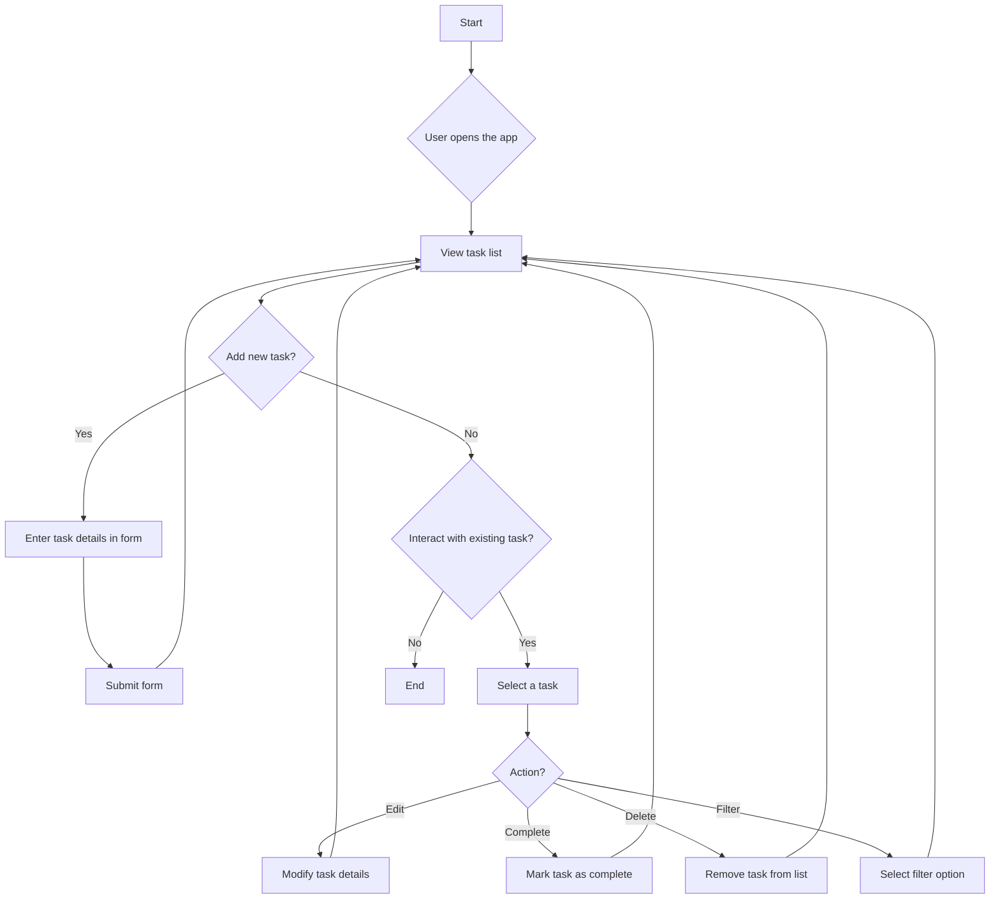

# Product Requirements Document: React To-Do App

## 1. Overview

This document outlines the requirements for a simple yet powerful To-Do list application. The application will allow users to manage their daily tasks efficiently. It will be a single-page application (SPA) built with React, focusing on a clean, intuitive, and responsive user interface.

## 2. Features

The application will include the following features:

-   **Create Task**: Users can add a new task with a title and an optional description.
-   **View Tasks**: All tasks are displayed in a clear list format.
-   **Update Task**: Users can edit the title and description of an existing task.
-   **Complete Task**: Users can mark tasks as completed. Completed tasks will be visually distinguished from active tasks.
-   **Delete Task**: Users can remove tasks they no longer need.
-   **Filter Tasks**: Users can filter the task list to show all, only active, or only completed tasks.
-   **Persistence**: Tasks will be saved to the browser's local storage to ensure data is not lost on page refresh.

## 3. User Stories

-   As a user, I want to add a new task so I can keep track of what I need to do.
-   As a user, I want to see all my tasks in a list so I can get a clear overview of my workload.
-   As a user, I want to edit a task in case I made a mistake or need to update it.
-   As a user, I want to mark a task as complete to visually track my progress.
-   As a user, I want to delete a task when it is no longer relevant.
-   As a user, I want to filter my tasks to focus on what I need to do next or review what I have accomplished.

## 4. Technical Stack

-   **Frontend Framework**: React
-   **Styling**: Tailwind CSS
-   **State Management**: React Context API or Zustand
-   **Persistence**: Browser Local Storage API

## 5. Component Structure

The application will be broken down into the following reusable components:

| Component    | Description                                                                                                  |
| :----------- | :----------------------------------------------------------------------------------------------------------- |
| `App`        | The root component that manages the overall application state and layout.                                    |
| `Header`     | Displays the application title and branding.                                                                 |
| `TodoForm`   | A form with input fields for adding a new task. Handles form submission.                                     |
| `TodoList`   | Renders the list of `TodoItem` components. It will also handle the filtering logic based on the user's selection. |
| `TodoItem`   | Represents a single task in the list. Displays task details and provides controls for editing, completing, and deleting the task. |
| `Filter`     | Contains buttons or controls that allow the user to filter tasks (e.g., All, Active, Completed).           |
| `Footer`     | (Optional) Can display additional information like the number of active tasks.                               |

## 6. Data Model

Each task will be an object with the following structure:

```json
{
  "id": "string", // A unique identifier (e.g., timestamp or UUID)
  "title": "string", // The title of the task
  "description": "string", // A more detailed description of the task
  "completed": "boolean" // The completion status of the task
}
```

## 7. Application Flow Diagram

Here is a Mermaid diagram illustrating the basic workflow of the To-Do application:

